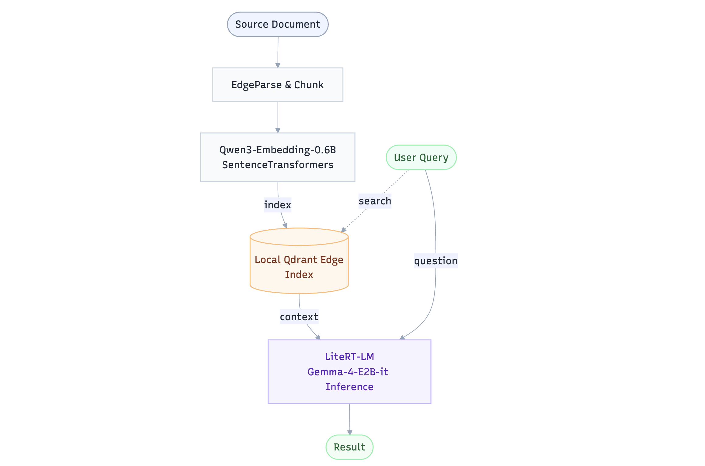
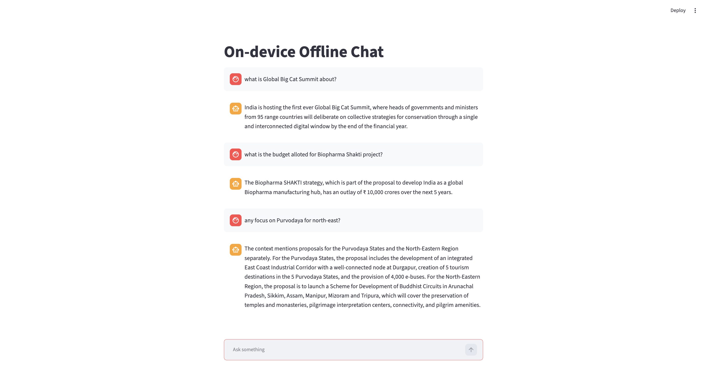

# Offline On-Device AI Application

Offline RAG demo that indexes `budget_2026.pdf` into Qdrant Edge, embeds queries
with a local Qwen embedding model, and answers from the retrieved context with a
local Gemma-4 LiteRT model.



## What This Uses

Qdrant Edge is the local vector database used by this project. `index.py`
creates a local Qdrant `Edge shard` in `qdrant_edge_eg`, stores PDF text chunks
with their embedding vectors, and later searches that shard for relevant
context.

LiteRT is the local runtime used to run the Gemma model file at
`models/gemma4/gemma-4-E2B-it.litertlm`. `app.py` and Streamlit `ui.py` both retrieve
context from Qdrant Edge and send that context to the LiteRT model for the final
answer.

## Install From `pyproject.toml`

Use Python 3.11 or newer.

```bash
python -m venv .venv
source .venv/bin/activate
pip install -e .
```

With `uv`:

```bash
uv venv --python 3.11
source .venv/bin/activate
uv pip install -e .
```

## Run Order

Run these steps in order.

### 1. Download Models (either Download from Source and run the script: only this part is oneline)

The app expects these local model paths:

- `models/qwen3_embed`
- `models/gemma4/gemma-4-E2B-it.litertlm`

Download the Gemma LiteRT model:

```bash
python download_model.py
```

Or with `uv`:

```bash
uv run download_model.py
```

`download_model.py` contains `download_embedding_model()` for the Qwen
embedding model and `download_gemma_litert_model` for the Gemma-4 LiteRT compatible model directly from HuggingFace. 

### 2. Build The Qdrant Edge Index

Run indexing before `app.py` or `ui.py`.

Index `budget_2026.pdf` or any other document into the local Qdrant Edge shard at `qdrant_edge_eg`:

```bash
python index.py
```

Or with `uv`:

```bash
uv run index.py
```

This runs `index.py`. It converts the PDF to markdown with `edgeparse`, chunks
the text, embeds each chunk with `sentence-transformers`, and stores the vectors
plus source text payloads in Qdrant Edge.

### 3. Run The CLI App

`app.py` is a simple one-question command line example. It uses a fixed question
inside the file, searches Qdrant Edge for relevant Budget PDF chunks, then asks
the local Gemma LiteRT model to answer using only that retrieved context.

```bash
python app.py
```

Or with `uv`:

```bash
uv run python app.py
```

### 4. Run The Streamlit UI

`ui.py` is the chat interface. It uses the same Qdrant Edge shard and LiteRT
model as `app.py`, but lets you type questions in the browser.

```bash
streamlit run ui.py
```

Or with `uv`:

```bash
uv run streamlit run ui.py
```



## Project Files

```text
runedge/
├── pyproject.toml        # Project dependencies and console scripts
├── README.md             # Setup and run instructions
├── budget_2026.pdf       # Source PDF used for indexing
├── models/
│   ├── qwen3_embed/      # Local Qwen embedding model used for vectors
│   └── gemma4/
│       └── gemma-4-E2B-it.litertlm  # Local Gemma LiteRT model file
└── qdrant_edge_eg/       # Local Qdrant Edge shard created by indexing
├── index.py              # Builds the Qdrant Edge index from the PDF
├── app.py                # One-question CLI RAG example
├── ui.py                 # Streamlit chat UI
├── download_model.py     # Downloads model assets from Hugging Face
├── quiet_native.py       # Suppresses native runtime stderr noise
```
